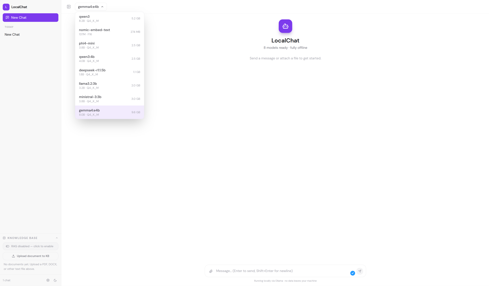

# LocalChat

A fully offline chat interface for your local Ollama models. No cloud. No telemetry. Runs a lightweight Python backend with optional RAG support.

<p align="center">
  
</p>


## Features

- Real-time streaming responses from any Ollama model
- Sidebar with grouped chat history (Today / Yesterday / Last 7 days / Older)
- Rename and delete chats
- Switch models mid-chat via a dropdown in the header
- Markdown rendering with syntax-highlighted code blocks
- Copy button on code blocks and messages
- Dark / light theme toggle
- Chat history persisted in `localStorage` (survives refreshes)
- Clear chat without losing the session
- Voice input. Offline speech-to-text via `faster-whisper`, no cloud STT service involved
- RAG (Retrieval-Augmented Generation) support via ChromaDB
- Python FastAPI backend proxies all Ollama requests (avoids CORS issues)

## Installation

There are two ways to run LocalChat: the prebuilt AppImage (fastest, no build tools needed) or from source (needed if you want to modify the code).

### Option A: AppImage (recommended)

Download `LocalChat-x86_64.AppImage` from the [Releases](https://github.com/macbuildssys/LocalChat/releases) page (or build it yourself. See [Building the AppImage](#building-the-appimage) below), then:

```
chmod +x LocalChat-x86_64.AppImage

./LocalChat-x86_64.AppImage
```

That's it, no installer, no `apt`/`dpkg`, nothing written outside your own home directory. It opens `http://127.0.0.1:8765` in your default browser automatically.

- Settings and chat data persist in `~/.config/localchat/` and `~/.local/share/localchat/` regardless of where you keep the AppImage file.

- To remove it, delete the `.AppImage` file — there's nothing else to uninstall. (Exception: if you used [AppImageLauncher](https://github.com/TheAssassin/AppImageLauncher) to integrate it into your app menu, that also creates a `.desktop` entry; remove that separately via your applications menu if you don't want it registered anymore.)

- To wipe your settings and RAG knowledge base along with it: `rm -rf ~/.config/localchat ~/.local/share/localchat`

### Option B: From source

See [Setup](#setup) below.

## Prerequisites

1. **Ollama** must be installed and running.

   - Install: https://ollama.com or `curl -fsSL https://ollama.com/install.sh | sh`

   - Start: `ollama serve` (or it may already be running as a systemd service)

   - Pull at least one model: `ollama pull llama3.2`

2. **Node.js 18+** and **npm** (for building the frontend).

3. **Python 3.10+** and **pip** (for the backend).

## Setup

```
# Clone or copy the project
git clone https://github.com/macbuildssys/ollama-orig.git

cd LocalChat

# Install frontend dependencies (one-time)
npm install

# Create and activate a Python virtual environment (one-time)
python3 -m venv venv

source venv/bin/activate   # fish shell: source venv/bin/activate.fish

# Install backend dependencies (one-time)
pip install -r requirements.txt

# Build the frontend
npm run build
```

## Run

```
source venv/bin/activate   # fish shell: source venv/bin/activate.fish

python3 run.py
```

Open http://localhost:8765 in your browser.

The backend proxies all Ollama requests, so you do not need to configure CORS settings in Ollama.

## Voice Input

Click the mic icon in the message box to record a voice message. It's transcribed locally via `faster-whisper` (no audio ever leaves your machine) and the text is inserted into the input box for you to review before sending.

The Whisper model size (tiny / base / small) is configurable in Settings; larger sizes are more accurate but slower on CPU. The very first transcription downloads the selected model from Hugging Face (one-time, needs internet); after that it's cached and runs fully offline.

**Voice input needs a "secure context."** Browsers only allow microphone (and clipboard) access on `https://` or on `127.0.0.1`/`localhost`; this is a browser-level restriction, not something LocalChat can bypass on its own.

- **Running LocalChat locally** (the normal case, same machine as your browser): this just works. `run.py` opens your browser at `http://127.0.0.1:8765`, which browsers already treat as secure by default. No setup needed.

- **Running LocalChat inside a VM and browsing from the host machine:** in this setup you're hitting the VM's network IP (e.g. `http://192.168.x.x:8765`) from the host browser, which is *not* a secure context, so voice input (and clipboard) will silently fail. Two fixes:
  - **SSH tunnel (works in any browser):** from the host, run `ssh -L 8765:127.0.0.1:8765 <user>@<vm-ip>`, then browse to `http://127.0.0.1:8765` on the host. This makes the connection genuinely loopback, so everything works normally.
  - **Chrome-only flag (quicker, single browser):** go to `chrome://flags/#unsafely-treat-insecure-origin-as-secure`, enable it, and add your VM's address (e.g. `http://192.168.x.x:8765`) to the text field, then relaunch Chrome. This tells Chrome to trust that one origin despite plain HTTP.

   Note this doesn't carry over if the VM's IP changes, and it has no equivalent in Firefox. The SSH tunnel is the more durable fix if you use multiple browsers or a DHCP-assigned VM IP.

## Accessing from Another Machine or VM

By default, LocalChat binds to `127.0.0.1:8765` and is only reachable from the same machine.

To allow access from another device on your network (e.g. a VM host or a second machine), start with:

```
OLLAMA_HOST=0.0.0.0 python3 run.py
```

Alternatively, edit the script `run.py` and change the uvicorn host from `0.0.0.0` to `127.0.0.1 (this is the current default). Then open the machine's local network IP in your browser:

```
http://192.168.x.x:8765
```

Note: `crypto.randomUUID()` requires a secure context in modern browsers. When accessing over plain HTTP from a non-localhost address, the app patches this automatically. If you see UUID-related errors, rebuild after pulling the latest changes.

Voice input does **not** have an equivalent automatic patch, see [Voice Input](#voice-input) above if you're in this networking setup and the mic button doesn't work.

If the host Ollama is on a different machine than where LocalChat is running, set the `OLLAMA_HOST` environment variable before starting:

```
OLLAMA_HOST=http://192.168.xxx.xxx:11434 python3 run.py
```

Make sure Ollama on the remote machine is also bound to `0.0.0.0`:

```
# On the machine running Ollama, edit its systemd service:

sudo systemctl edit ollama

# Add (Add the service and environment as shown below):

# [Service]
Environment="OLLAMA_HOST=0.0.0.0:11434"

# Restart ollama:

sudo systemctl restart ollama
```

## Current Models (example: `ollama list`)

```
qwen3:4b                   2.5 GB
phi4-mini:latest           2.5 GB
llama3.2:3b                2.0 GB
ministral-3:3b             3.0 GB
deepseek-r1:1.5b           1.1 GB
gemma4:e4b                 9.6 GB
nomic-embed-text:latest    274 MB
```

All of these appear automatically in the model dropdown once Ollama is running.

## Adding New Models

```
ollama pull mistral

ollama pull codellama

ollama pull deepseek-coder-v2
```

Refresh the browser tab after pulling. The new model appears in the dropdown immediately.

## Build for Production

```
npm run build

python3 run.py
```

The backend serves the built frontend directly. There is no separate static file server needed.

## Building the AppImage

Requires Node/npm, Python/pip, and `pyinstaller` (`pip install pyinstaller`) on the build machine. None of these are needed by whoever just runs the resulting `.AppImage`.

```
chmod +x package/build-appimage.sh

./package/build-appimage.sh
```

This builds the frontend, runs PyInstaller against `localchat.spec`, assembles the AppDir, downloads `appimagetool` if it isn't already cached in `build/`, and produces `LocalChat-x86_64.AppImage` in the project root. Expect a few minutes for the PyInstaller step (bundling ChromaDB and faster-whisper's dependencies is the slow part) and a final size in the 95–250MB range.

## Data Storage

Chat sessions are stored in your browser's `localStorage` under the key `localchat-v1`. No chat data is written to disk by the app itself.

RAG document embeddings and app settings are stored outside the project/app directory in standard per-user locations, so they persist across rebuilds and work correctly from a read-only AppImage mount:

- Settings (`config.json`, including Ollama host and Whisper model size): `~/.config/localchat/`

- RAG vector store (ChromaDB): `~/.local/share/localchat/chroma_db/`

If you're upgrading from an older version that stored these next to the project files, they're migrated automatically the first time the new version runs.

To export or back up chats, open DevTools (F12 or Ctrl + Shift + I) and navigate to Application > Local Storage (Chrome) or Storage > Local Storage (Firefox), then copy the JSON value under the `localchat-v1` key.

## Troubleshooting

**"Could not connect to Ollama"**
- Run `ollama serve` in a terminal.

- Check `ss -tlnp | grep 11434` to confirm Ollama is listening.

- If Ollama is on a different machine, set `OLLAMA_HOST` as described above and ensure port 11434 is not blocked by a firewall.

**Backend fails to start with `ModuleNotFoundError`**
- Make sure the virtual environment is activated: `source venv/bin/activate.fish`

- Run `pip install -r requirements.txt` inside the venv.

**Model not appearing in the dropdown**
- Run `ollama list` to verify it is downloaded.

- Refresh the browser tab.

**Slow responses**
- Normal for large models (gemma4, phi4, etc.) on CPU.

- Use `qwen3:4b` or `llama3.2:3b` for faster responses on lighter hardware.

**Port 8765 not reachable from another machine**
- Check the firewall on the machine running LocalChat: `sudo ufw allow 8765`

- Confirm the backend is bound to `0.0.0.0` and not `127.0.0.1`.

**Mic button doesn't record / "Cannot read properties of undefined (reading 'getUserMedia')"**
- This means the page isn't running in a browser "secure context" — almost always because you're browsing to a non-`127.0.0.1` address (a VM's LAN IP, a remote host, etc.). See [Voice Input](#voice-input) above for the SSH tunnel / Chrome flag fixes.

- Confirm in DevTools console: `window.isSecureContext` should be `true`. If it's `false` on `127.0.0.1` itself (rare), check for a system-wide proxy or VPN intercepting loopback traffic.

**Transcription fails with an ONNX/model file error**
- Make sure you're on a build with the fixed `localchat.spec` (bundles `faster_whisper`'s VAD asset explicitly); older AppImage builds could produce a bundle missing `silero_vad_v6.onnx`.

- The very first transcription needs internet access once to download the Whisper model from Hugging Face; subsequent runs are fully offline.

## Tech Stack

| Layer            | Technology                              |
|------------------|-----------------------------------------|
| UI framework     | React 18 + TypeScript + Vite            |
| Styling          | Tailwind CSS                            |
| State / store    | Zustand (persisted to localStorage)     |
| Markdown         | react-markdown + remark-gfm             |
| Highlighting     | rehype-highlight + highlight.js         |
| Icons            | lucide-react                            |
| Fonts            | DM Sans + JetBrains Mono (Google Fonts) |
| Backend          | Python + FastAPI + uvicorn              |
| Voice input      | faster-whisper (offline STT)            |
| RAG / embeddings | ChromaDB                                |
| HTTP client      | httpx                                   |
| LLM backend      | Ollama (local)                          |
| Packaging        | PyInstaller + AppImage                  |

## License

Distributed under the MIT License. See [LICENSE](LICENSE).